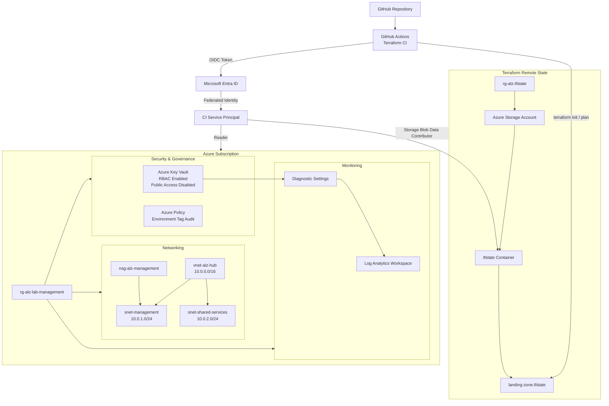

# Secure Azure Landing Zone

A portfolio-scale Azure landing zone built with Terraform, demonstrating secure cloud architecture, identity-based access, governance, centralized monitoring, remote state management, and secretless CI authentication.

## Architecture



## Key Features

- Modular Terraform architecture
- Azure Blob Storage remote Terraform state
- Blob versioning and delete-retention protection
- Hub virtual network with segmented management and shared-services subnets
- Network Security Group association
- Centralized Log Analytics workspace
- Azure Key Vault using Azure RBAC
- Key Vault public network access disabled
- Key Vault audit logs forwarded to Log Analytics
- Custom Azure Policy for Environment-tag governance
- GitHub Actions Terraform CI
- Microsoft Entra workload identity federation using OIDC
- Secretless GitHub-to-Azure authentication
- Least-privilege CI identity
- Automated Terraform formatting, initialization, validation, and planning

## Repository Structure

```text
azure-secure-landing-zone/
├── .github/
│   └── workflows/
│       └── terraform.yml
├── bootstrap/
│   ├── main.tf
│   ├── outputs.tf
│   ├── providers.tf
│   ├── terraform.tfvars.example
│   └── variables.tf
├── modules/
│   ├── networking/
│   │   ├── main.tf
│   │   ├── outputs.tf
│   │   └── variables.tf
│   └── security/
│       ├── main.tf
│       ├── outputs.tf
│       └── variables.tf
├── terraform/
│   ├── backend.tf
│   ├── main.tf
│   ├── outputs.tf
│   ├── providers.tf
│   ├── terraform.tfvars.example
│   └── variables.tf
├── .gitignore
└── README.md
```

## Terraform State

The remote backend is bootstrapped separately from the primary landing-zone deployment.

The bootstrap configuration creates:

- Dedicated Terraform state resource group
- Azure Storage Account
- Private Blob container
- Blob versioning
- Blob delete-retention protection
- Azure RBAC for state access

The main Terraform configuration stores state in Azure Blob Storage rather than on a developer workstation.

## Networking

The networking module deploys:

```text
vnet-alz-hub
10.0.0.0/16

├── snet-management
│   10.0.1.0/24
│   └── nsg-alz-management
│
└── snet-shared-services
    10.0.2.0/24
```

The design provides a reusable foundation that can be extended into a larger hub-and-spoke Azure architecture.

## Security and Governance

### Azure Key Vault

The security module deploys Key Vault with:

- Azure RBAC authorization
- Public network access disabled
- Explicit privileged identity assignment
- Soft-delete retention
- Centralized audit logging

The Key Vault administrator is passed to Terraform explicitly instead of being derived from the identity running Terraform. This prevents a CI identity from unintentionally replacing the intended privileged principal.

### Azure Policy

A custom Azure Policy audits resources that do not contain the required `Environment` tag.

The policy uses an `Audit` effect so compliance issues can be identified without blocking development in the lab environment.

### Centralized Logging

Key Vault `AuditEvent` telemetry is forwarded through Azure Monitor diagnostic settings to the centralized Log Analytics workspace.

This provides a foundation for future Microsoft Sentinel and KQL detection engineering.

## CI/CD and Workload Identity Federation

Terraform CI is implemented with GitHub Actions.

```text
Checkout Repository
        ↓
Setup Terraform
        ↓
Azure Login with OIDC
        ↓
terraform fmt -check
        ↓
terraform init
        ↓
terraform validate
        ↓
terraform plan
```

GitHub Actions authenticates to Azure using Microsoft Entra workload identity federation and short-lived OIDC tokens.

No Azure client secret or long-lived application credential is stored in GitHub.

The CI identity is assigned:

- `Reader` at Azure subscription scope
- `Storage Blob Data Contributor` for Terraform remote state

The pipeline intentionally performs validation and planning rather than automatic deployment, limiting the privileges required by the CI identity.

## Local Usage

Authenticate to Azure:

```bash
az login
```

Create a local variables file:

```bash
cp terraform/terraform.tfvars.example terraform/terraform.tfvars
```

Then:

```bash
terraform -chdir=terraform init
terraform -chdir=terraform validate
terraform -chdir=terraform plan
```

## Design Decisions

### Remote State

Terraform state is centralized in Azure Blob Storage instead of being stored only on a developer workstation.

### OIDC Instead of Client Secrets

GitHub Actions uses Entra workload identity federation rather than storing a service-principal password.

### Explicit Privileged Identity

The Key Vault administrator is supplied explicitly as a Terraform variable, preventing the executing identity from automatically becoming privileged.

### RBAC-Based Key Vault Authorization

Azure RBAC is used instead of legacy Key Vault access policies.

### Disabled Key Vault Public Access

Key Vault public network access is disabled. A production extension could add Private Endpoint and Private DNS connectivity.

### Audit-First Governance

Azure Policy initially audits violations rather than blocking development. Production environments could progressively enforce controls using `Deny`, `Modify`, or `DeployIfNotExists`.

## Future Enhancements

- Hub-and-spoke workload VNets
- Azure Private DNS
- Key Vault Private Endpoint
- Azure Firewall
- Microsoft Defender for Cloud
- Microsoft Sentinel and KQL detections
- Additional Azure Policy initiatives
- Management-group hierarchy
- Separate development and production subscriptions
- Protected deployment environments and approval gates
- Dedicated Terraform deployment identity
- IaC security scanning with Checkov or Trivy

## Skills Demonstrated

Terraform · Microsoft Azure · Microsoft Entra ID · Azure RBAC · Azure Policy · Azure Key Vault · Azure Monitor · Log Analytics · Azure Networking · GitHub Actions · CI/CD · OIDC · Workload Identity Federation · Infrastructure as Code · Cloud Security
